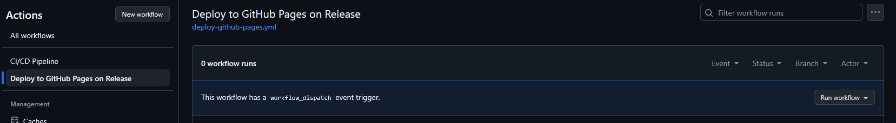

# Vue-Material

## Installation

### 1. Setup git

...

### 2. GitHub Pages

Si vous souhaitez supprimer le système de déploiement sur GitHub Pages:

- Supprimez ".github/workflows/deploy-github-pages.yml"
- Supprimez la ligne suivante:

```ts
base: process.env.NODE_ENV === 'production' ? '/vue-material' : '/'
```

Sinon, modifiez `"vue-material"` dans [`vite.config.ts`](vite.config.ts) et mettez le nom du dépôt Github.

Afin de déployer l'application sur Github Pages, vous pouvez:

- Publier une release
- Activer manuellement le _workflow_; voir ci-dessous le bouton 'Run workflow' :
  

---

## Todo list

- [ ] Navigation bar & rail (rework)
- [ ] Checkbox
- [ ] Switch
- [ ] Radio button
- [ ] Chips
- [ ] Text fields
- [ ] Sliders
- [ ] Tabs
- [ ] App bars
- [ ] Carousel
- [ ] Date pickers
- [ ] Time pickers
- [ ] Dialogs
- [ ] Lists
- [ ] Menus
- [ ] Split buttons
- [ ] FAB menu
- [ ] Button groups
- [ ] Bottom sheets
- [ ] Side sheets
- [ ] Full-view sheets
- [ ] Toolbars
- [ ] Tooltips